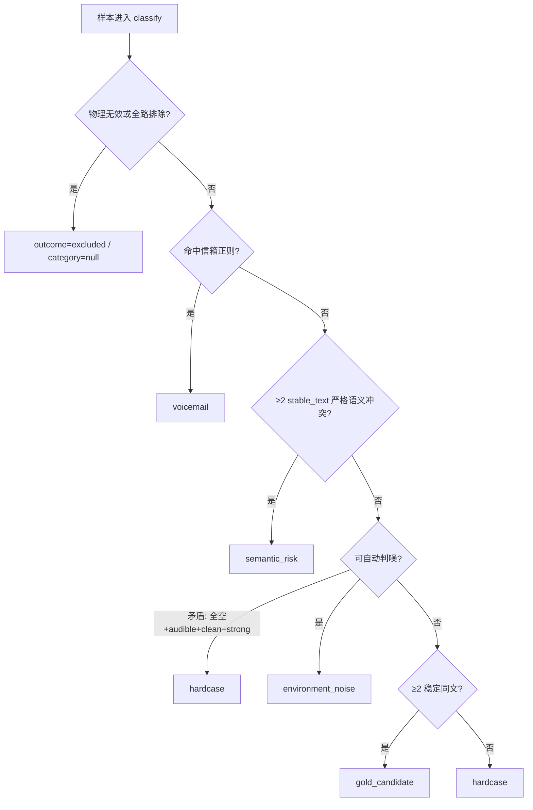

# 五类分拣规则与决策流程

| 项 | 值 |
| --- | --- |
| 现行口径 | `selection_five_class_v2_2_auto_noise`（简称 **v2.2**） |
| 修订日期 | 2026-09-18 |
| 正式入口 | `pipelines/classify_dataset_five_class_v2_2_auto_noise.yaml` |
| 策略配置 | `configs/selection/zh_asr_five_class_v2_2_auto_noise.yaml` |
| 实现 | `src/audio_engine/core/selection_v3/five_class_v2_2.py` |
| 需求依据 | [028](../04-改进需求/已完成/028-五分类自动噪声归类与互斥准入修复.md)、[029](../04-改进需求/已完成/029-五分类v2.2-DNSMOS联合判定修复.md) |
| 版本增量规范 | [v2](./数据挑选规则_v2_auto_noise.md) → [v2.2](./数据挑选规则_v2_2_auto_noise.md) |
| 操作手册 | [服务器端五类完整自动分类与 XLSX 导出](../07-操作手册/服务器端五类完整自动分类与XLSX导出.md) |

本文描述**当前生产真实状态**：五个业务类别是什么、证据层如何构建、以及样本如何逐步落入某一类。与 v1/v2 增量规范冲突时，以本文 + 代码实现为准；v1/v2 仅作对照复现。

---

## 1. 在工序中的位置

工序一路径 B（无外源金标）的默认分拣步骤：

```text
清洗落库
  → 多家族 ASR（默认 Qwen / GLM / SenseVoice，每族双跑，共六路）
  → prepared / prepared_asr 对齐
  → 音频能量（audio_energy）
  → DNSMOS 候选评分（仅候选子集）
  → 五类自动分类（classify）
  → export-summary / 可选人审 / Release
```

前提与边界：

- 上游已做 VAD；本项目**不重跑 VAD**，也不重跑 GPU ASR。
- 分类须在能读 `resampled_16k` 的服务器执行；Windows 只接收最终 Parquet / XLSX。
- 契约：**N≥3 家族 × 每族双跑**即可（四族为可选增强）。
- 产物与 v1 / v2 / legacy v3 **隔离命名**，禁止互相覆盖。

流水线算子顺序（正式入口）：

```text
quality.audio_energy
  → quality.dnsmos_v2_2_candidates
  → quality.classify（rule_version=selection_five_class_v2_2_auto_noise）
```

---

## 2. 样本出口（互斥）

| 出口 | `outcome` | `category` | 含义 |
| --- | --- | --- | --- |
| 业务分类 | `classified` | 五类之一 | 成功进入决策的样本必落一类 |
| 前置排除 | `excluded` | `null` | 物理无效，或全部路次被前置规则排除 |

禁止：

- 成功分类样本出现 `category=null`
- 以 `manual_annotation` / `pending_evidence` 作为业务主出口
- 把 `excluded` 当成第六个业务类别

`hardcase` 上的 `needs_review` / `review_reason` 只是附属动作，不是独立出口。

---

## 3. 五个业务类别

决策顺序（**命中即结束**）：

```text
voicemail → semantic_risk → environment_noise → gold_candidate → hardcase
```

| 类别 | 一句话 | 典型 `decision` / `status` |
| --- | --- | --- |
| `voicemail` | 任一有效路次命中语音信箱正则 | `exclude` / `excluded` |
| `semantic_risk` | ≥2 个 `stable_text` 家族对同一命题明确冲突 | `manual_review` / `manual_review` |
| `environment_noise` | 家族状态 + 音频能量（+ DNSMOS）自动判噪 | `exclude` / `excluded` |
| `gold_candidate` | ≥2 个稳定有字家族支持同一文本 | `audit_pending` / `candidate` |
| `hardcase` | 前四类未命中的唯一业务兜底 | `manual_review` / `manual_review` |

### 3.1 `voicemail`

- 任一 `ROUTE_ELIGIBLE` 且成功的路次，在 `body_text` / `classify_text` / `transcript_text` 上命中 `voicemail_patterns_v1` 即入类。
- DNSMOS **不得**改主类。
- 置信度通常为 `high`；进入信箱隔离队列。

### 3.2 `semantic_risk`

- 仅看多个 `stable_text` 家族之间的严格语义冲突（极性反转、同命题对立等）。
- **空转写 vs 有字** 不算语义风险（交给噪声 / hardcase）。
- `hallucinated_assertion` 不走本类（028 口径）。
- DNSMOS **不得**改主类；默认 P0 人审队列。

### 3.3 `environment_noise`

自动噪声子类 `noise_kind`：

| 子类 | 条件摘要 |
| --- | --- |
| `audio_too_short` | `energy_state=too_short`（未先命中信箱/语义风险）；不依赖 DNSMOS |
| `silence` | 全部家族 `stable_empty` 且 `energy_state=inaudible`；DNSMOS 不得改判为人声噪声 |
| `background` | 全部家族 `stable_empty` 且可闻（或 borderline + DNSMOS=`noisy`） |
| `human_noise` | ≥2 稳定空 + 恰好 1 稳定有字 + 无不稳定/不可用 + 可闻（或 borderline + noisy）；唯一文本非关键短应答 |
| `crosstalk` | 先满足 `human_noise`，且已有可信 `human_crosstalk_confirmed` |

禁止自动入噪（改走后续类或 hardcase）：

- ≥2 家族已同文支持（金标路径）
- 族内 `unstable` / 证据失败冒充空
- `energy_state=failed`
- `borderline` 且 DNSMOS 非 `noisy`
- 唯一文本为关键短应答（如「要/不要/可以/不行」等配置表）

### 3.4 `gold_candidate`

- ≥2 个 `stable_text` 家族两两（或成簇）无害等价。
- 第三家族 `stable_empty` 可审计，不否决；任一相关 `unstable` 否决。
- 按家族权重选文（默认 qwen:2 / glm:1 / sensevoice:1）。
- DNSMOS=`noisy` 时**只**可附 `quality_tag=background_noisy`，**不得**改主类。

### 3.5 `hardcase`

唯一业务兜底；须写具体 `hardcase_reason`。常见原因：

| `hardcase_reason` | 场景 |
| --- | --- |
| `empty_asr_but_clean_strong_speech` | 全空 ASR + audible + DNSMOS clean + strong speech（矛盾） |
| `energy_borderline` | 能量 borderline 且未能被 DNSMOS noisy 收敛 |
| `energy_failed` | 能量计算失败 |
| `family_unstable` | 存在族内双跑不稳定 |
| `critical_short_response_unsupported` | 唯一短应答关键词，无法自动当人声噪声 |
| `single_text_family_not_auto_noise` | 两空一有字但未满足自动噪声条件 |
| `substantive_divergence_non_strict_risk` | 多族实质分歧但未达严格语义风险 |
| `insufficient_family_evidence` | 家族证据不足 / unavailable 混杂 |
| `hardcase_fallback` / `unresolved:*` | 其余未解析规则 |

---

## 4. 证据层

### 4.1 家族四态

每个配置家族的双跑先归并为恰好一态：

| 状态 | 条件 |
| --- | --- |
| `stable_text` | 两路成功且 `classify_text` 非空，相等或仅无害差异 |
| `stable_empty` | 两路成功且清洗后均为空（真实空 / 仅标签标点） |
| `unstable` | 一空一有字、实质冲突、仅一路成功、或成功空 + 对端失败/排除 |
| `unavailable` | 两路均失败 / 缺失 / 无法形成证据 |

**推理失败、缺失、外语/回声排除不得计为 `stable_empty`。**

无害等价：简繁一致、容错键一致；「吗/吧」等语气差异不视为无害等价。

### 4.2 音频能量

配置：`configs/quality/audio_energy_v1.yaml`（改阈值必须升 `policy_version`）。

| `energy_state` | 含义 |
| --- | --- |
| `too_short` | 时长低于 `min_duration_ms` |
| `inaudible` | 能量过低，视为静音 |
| `audible` | 明确可闻 |
| `borderline` | 落在阈值边际带 |
| `failed` | 读音频或计算失败 |

默认工程阈值（以配置文件为准）：`min_duration_ms=300`，`min_rms_dbfs=-50`，`min_peak_dbfs=-40`，`min_non_silent_ratio=0.02`，`borderline_margin_db=3`。

### 4.3 DNSMOS 决策状态（v2.2）

配置：`configs/quality/dnsmos_decision_v2_2.yaml`。  
注意：`dnsmos_p835.yaml` 的 `calibrated` 只影响 legacy `noise_band`，**不要**靠改 `calibrated` 影响 v2.2 分类。

| `dnsmos_noise_state` | 条件 |
| --- | --- |
| `unavailable` | status≠success 或分数缺失 |
| `noisy` | BAK &lt; 3.0 **或** OVRL &lt; 2.8 |
| `clean` | BAK ≥ 3.5 **且** OVRL ≥ 3.2 |
| `moderate` | 其余有效分数 |

| `dnsmos_speech_state` | 条件 |
| --- | --- |
| `strong` / `weak` / `unknown` | 由 SIG 相对 `strong_sig` / `weak_sig` 形成 |

SIG **不单独**证明目标说话人。DNSMOS 不可用时审计回退到 v2 强规则：不整批进 hardcase，不伪造 `noisy`。

---

## 5. 完整决策流程



逐步说明：

1. **输入契约**：坏音频 / 全路 `ROUTE_EXCLUDED` → `excluded`。
2. **信箱**：任一有效路次正则命中 → `voicemail`。
3. **语义风险**：多稳定有字家族严格冲突 → `semantic_risk`。
4. **环境噪声（含 DNSMOS 联合）**：
   - `too_short` → `audio_too_short`
   - 全空 + `inaudible` → `silence`
   - 全空 + `audible`：
     - DNSMOS noisy → `background`（high）
     - moderate / clean（非 strong speech）→ `background`（medium）
     - clean + strong speech → `hardcase`（矛盾）
     - unavailable → `background`（medium，v2 回退）
   - 全空 + `borderline` + noisy → `background`（medium）
   - 两空一有字 + audible/borderline(+noisy) → `human_noise`（关键短应答除外）
5. **金标候选**：≥2 稳定同文 → `gold_candidate`；noisy 仅打质量标签。
6. **hardcase**：其余全部落入，并写明原因。

### 5.1 DNSMOS 联合速查

| 场景 | 结果 |
| --- | --- |
| 全空 + audible + noisy | `environment_noise/background`，confidence=high |
| 全空 + audible + unavailable | `background`，medium（v2 回退） |
| 全空 + audible + clean + strong | `hardcase/empty_asr_but_clean_strong_speech` |
| 全空 + borderline + noisy | `background`，medium |
| 两空一有字 + audible + noisy | `human_noise`，high |
| 两空一有字 + borderline + noisy | `human_noise`，medium |
| ≥2 稳定同文 + noisy | 仍 `gold_candidate` + `quality_tag=background_noisy` |

---

## 6. 产物与命令

| 产物 | 路径模式 |
| --- | --- |
| 分类 Parquet | `datasets/stage1/derived/classified_five_class_v2_2_auto_noise_${BATCH}.parquet` |
| 汇总 XLSX | `data/exports/summary_five_class_v2_2_auto_noise_${BATCH}.xlsx` |

```bash
# 正式分拣
audio-data pipeline run pipelines/classify_dataset_five_class_v2_2_auto_noise.yaml \
  --source-name "$BATCH" \
  --config configs/selection/zh_asr_five_class_v2_2_auto_noise.yaml \
  --force

# 导出查看表
audio-data review export-summary \
  "datasets/stage1/derived/classified_five_class_v2_2_auto_noise_${BATCH}.parquet" \
  --output "data/exports/summary_five_class_v2_2_auto_noise_${BATCH}.xlsx" \
  --max-rows 20000
```

六路 ASR 已齐、只做后置分类时，可用：

```bash
python scripts/classify_asr_to_xlsx.py --batch "$BATCH"
# 或：audio-data stage1 classify --batch "$BATCH"
```

stage1 单命令整批编排见 [工序一单命令手册](../07-操作手册/工序一单命令-服务器1000条试跑.md)。

---

## 7. 版本对照

| 版本 | 入口 | 噪声依据 | 产物前缀 |
| --- | --- | --- | --- |
| **v2.2（现行）** | `classify_dataset_five_class_v2_2_auto_noise` | 家族四态 + 能量 + DNSMOS 联合 | `classified_five_class_v2_2_auto_noise_*` |
| v2（对照） | `classify_dataset_five_class_v2_auto_noise` | 家族四态 + 能量（无联合语义） | `classified_five_class_v2_auto_noise_*` |
| v1（历史） | `classify_dataset_five_class_v1` | 旧按需 DNSMOS 旁证 | `classified_five_class_v1_*` |
| legacy v3 | `classify_dataset_v3_asr_anomaly_noise` | selection_v3.0 | `classified_v3_*` 等 |

---

## 8. 相关代码与配置

| 角色 | 路径 |
| --- | --- |
| v2.2 分类器 | `src/audio_engine/core/selection_v3/five_class_v2_2.py` |
| v2 基线（被 v2.2 复用） | `src/audio_engine/core/selection_v3/five_class_v2.py` |
| DNSMOS 决策 | `src/audio_engine/core/selection_v3/dnsmos_decision.py` |
| 音频能量 | `src/audio_engine/core/selection_v3/audio_energy.py` |
| 选择配置 | `configs/selection/zh_asr_five_class_v2_2_auto_noise.yaml` |
| 能量阈值 | `configs/quality/audio_energy_v1.yaml` |
| DNSMOS 决策阈值 | `configs/quality/dnsmos_decision_v2_2.yaml` |
| 信箱正则 | `configs/selection/voicemail_patterns_v1.yaml` |
| 语义词表 | `configs/selection/semantic_lexicon_zh_v3.yaml` |
| 单测 | `tests/test_selection_five_class_v2_2_auto_noise.py` |
